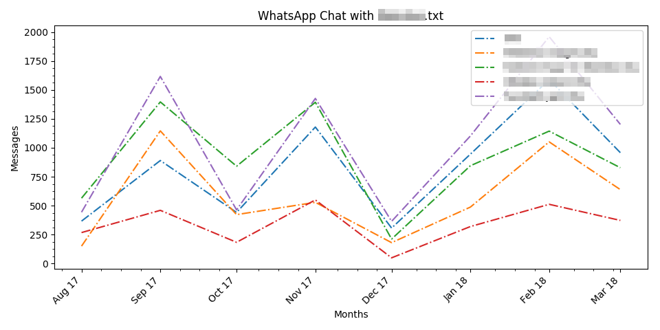
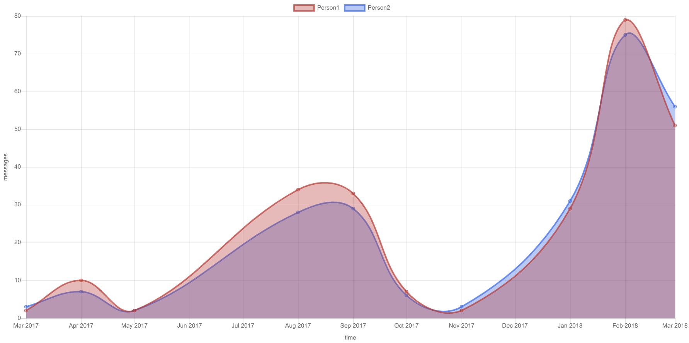

# WhatsApp Chat Plot
This repo consists of a python script and a WebApp that plots a timeline of messages exchanged on the popular messaging platform WhatsApp. You need to supply a txt file which is basically your chat exported from WhatsApp.

**NOTE**: YOUR MESSAGES ARE NOT SENT OR SAVED ANYWHERE. YOU'RE FREE TO READ THE CODE AND CHECK FOR YOURSELVES.

## Update
This tool is now available [here](https://vishal-wadhwa.github.io/WhatsApp-Chat-Plot/) with multiple options. Go play with them.

- Python

- WebApp

## Usage 
1. Exporting chat: 

    a. Open WhatsApp settings.  
    b. Go to chat settings.  
    c. Then chat history.  
    d. Then export chat.  
    e. Now select the chat you want to export _without media_.

2. Then just execute this script: `python main.py whatsappchat.txt`. (python)

3. Image will be saved as a `png` file in the same directory as `txt` file. (python)

## Dependencies (python)
[matplotlib](https://matplotlib.org/)

## Todo:
- [] Add support for other graphs like polar, doughnut, pie & radar.
- [x] Update sample file link in index.html
- [x] Update app link in readme
- [x] add screenshots

## Bugs:
- [] Some parameters trigger change of color in the WebApp.
